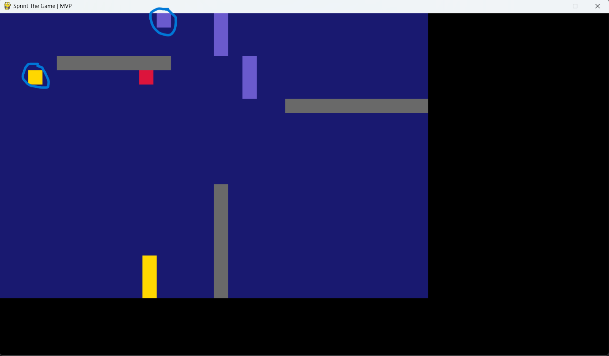

# CodingWeeks2-jeeth (Juliette, Emmanuel, Enzo, Thomas, Henrik)

Pour cette deuxième semaine, nous avons voulu créer un jeu type puzzle, basé sur deux jeux que nous aimions beaucoup.

Le but est simple, il est constitué d'une grille, et de un ou plusieurs personnages controlés simultanéments par
l'utilisateur.

Un personnage c'est :

- représenté par un carré qui se déplace dans la grille
- d'une couleur qui peut changer pendant le jeu

La grille contient :

- un ensemble de murs de différentes couleurs
- un point de départ pour chaque personnage
- un point d'arrivé attribué à chaque personnage
- des 'color switcher' qui permettent de changer la couleur du joueur lorsque ce dernier passe dessus

L'objectif de l'utilisateur est de positionner tous les personnages sur leur point d'arrivé, sachant qu'un personnage
traverse les murs de sa couleur.

Ceci est le MVP réalisé dans le cadre des coding weeks de CentraleSupélec :


## Getting started

Vous voulez tester ce MVP ? Voici ce qu'il faut faire :

- Cloner cette branch de notre repository sur votre ordinateur:

```
git clone -b MVP-demo https://gitlab-student.centralesupelec.fr/enzo.le-van/codingweeks2-jeeth.git
```

- Le jeu a été développé sous Python 3.11.5, mais il doit être compatible avec toute version de python >3.11 sur MacOS
  et
  Window. Assurez vous donc d'avoir une telle version avec la commande qui suit. Si ce n'est pas le cas vous pouvez
  télécharger et mettre à jour votre python au lien suivant:

```
python --version
(or python3 --version)
```

https://www.python.org/downloads/release/python-3115/

- Il faut ensuite installer les bibliothèques utilisées dans ce projet, elles sont au nombre de deux, indiquées dans le
  fichier 'requirements.txt'. Néanmoins pour ne pas compromettre votre installation globale de python, nous vous
  proposons de travailler avec un environnement virtuel. C'est à dire un second python et un second pip directement
  intégrés dans le projet. Ouvrez alors un terminal dans le dossier cloné:

```
python -m venv venv

.\venv\Scripts\pip install -r requirements.txt (sur windows)
```

- Vous pouvez alors lancer le jeu en faisant :

```
.\venv\Scripts\python main.py (sur python)
```

- Une fenêtre Pygame noire s'ouvre alors, et le terminal vous demande de sélectionner le numéro du niveau auquel vous
  voulez jouer, pour le moment il n'y a rien d'autre que le niveau '0'. Rentre donc '0'


- Vous pouvez alors vous déplacer avec les touches LEFT,RIGHT,UP,DOWN du clavier, sachant que vous êtes le petit carré
  rouge en haut à gauche de l'écran, et que votre but est d'atteindre le point en bas à droite de la grille en vous
  déplaçant.


- Il y'a deux colors switcher dans ce niveau qui sont ici :



- à votre victoire il vous sera demandé de répondre dans le terminal:


## Points d'attention

Nous tenons à vous signaler que si vous avez suivis les étapes de l'installation, vous vous retrouvez avec un
environnement python dans votre dossier, avec seulement les bibliothèques numpy et pygame. Le dossier peut alors être
lourd.

Ceci est un MVP, dont voici les points d'améliorations pour le produit final:

- Le personnage n'est pas reconnaissable
- Le personnage est trop lent
- Les color switchers ne sont pas reconnaissable
- le point de départ n'est pas marqué dans la grille, et même si ce n'est pas vital il faut marquer le point d'arrivé
- la grille n'est pas centrée dans la fenêtre
- il faudrait une interface graphique pour sélectionner un niveau ou retenter le niveau, pas dans un terminal
- le jeu est trop 'static' : rien ne bouge et il n'y a pas d'effet particulier

Tous ces points d'améliorations ont été traités, vous pouvez le retrouver dans la branch principale :

https://gitlab-student.centralesupelec.fr/enzo.le-van/codingweeks2-jeeth